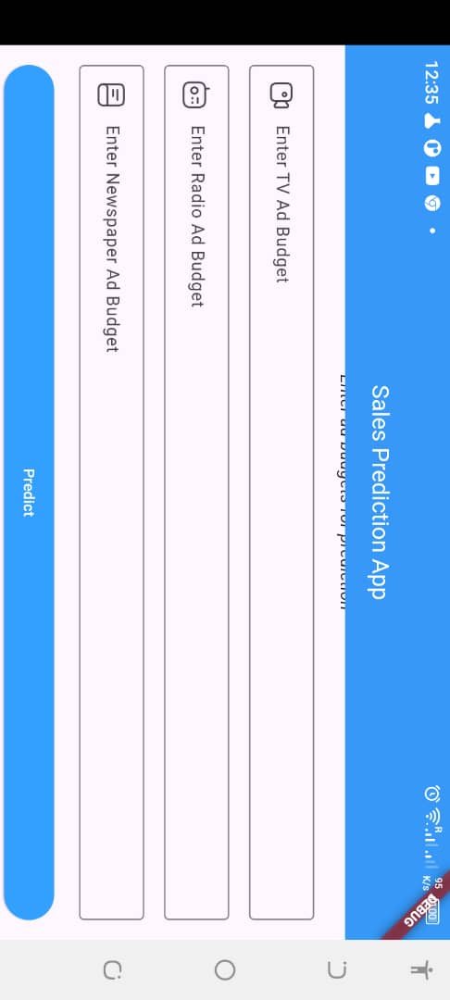
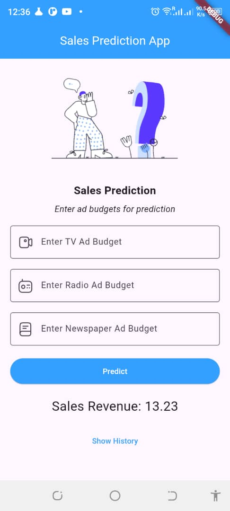

# Sales Prediction Model and App

Welcome to the Sales Prediction Model and App repository. This repository contains Three main components: a machine learning model that predicts sales revenue based on advertising budgets and a Flutter app that interacts with the model to provide sales predictions, and a folder for the Colab Notebook on Univariate regression. This README file will guide you through the structure, setup, and usage of both components.

## Screenshots

## Table of Contents

- [Introduction](#introduction)
- [Repository Structure](#repository-structure)
- [Requirements](#requirements)
- [Setup and Installation](#setup-and-installation)
- [Model Overview](#model-overview)
- [Flutter App Overview](#flutter-app-overview)
- [Usage](#usage)
- [Screenshots](#screenshots)
- [Contributing](#contributing)
- [License](#license)

## Introduction

This repository contains a machine learning model that predicts sales revenue based on advertising budgets for TV, Radio, and Newspaper ads. The model is deployed on Render.com and is consumed by a Flutter app that allows users to input their ad budgets and receive a predicted sales revenue.

## Repository Structure

The repository is structured as follows:

- `ad_budget_sales/`: Contains the files related to the machine learning model, including the file used for training the model and the requirements file for dependencies.
- `sales_app/`: Contains the Flutter app files, including the main Dart code and other related resources.
- `linear_regression_with_one _feature/`: Contains the Univariate file used for practicing and the colab notbook from the Canvas.

## Requirements

To install the necessary dependencies for the machine learning model, navigate to the `ad_budget.py/files/` directory and use the following command:

- pip install -r requirements.txt

- python run ad_budget.py
- The model will be saved as a .joblib file

## Set up and Installation

After setting up the Backend, run fastapi run dev main to take you to a local host.
Navigate to /docs/predict and try out the end point

cd ..
cd into sales_app
run `flutter run` to build the Flutter project.

## Model Overview
The machine learning model predicts sales revenue based on the budgets allocated for TV, Radio, and Newspaper advertisements. It uses a linear regression algorithm to make the predictions. The model was trained using historical advertising data and is deployed as an API endpoint on Render.com.

## Usage in Flutter App
The Flutter app interacts with the deployed model through an HTTP POST request. Users input their ad budgets for TV, Radio, and Newspaper ads, and the app sends these inputs to the model's endpoint. The model then returns the predicted sales revenue, which is displayed in the app.

Endpoint
- The  deployed on rendee API endpoint for the model is: `https://ad-sales-model.onrender.com/predict`
-FastAPI swagger end point: `http://127.0.0.1:8000/docs#/default/predict_predict_post`

## Flutter App Overview
The Flutter app provides a user-friendly interface for predicting sales revenue. Users can enter their advertising budgets, and with the click of a button, receive a sales prediction. The app also maintains a history of past predictions for reference.

### Key Features
Input fields for TV, Radio, and Newspaper ad budgets.
Button to trigger sales prediction.
Display of predicted sales revenue.
History of past predictions.
Usage
Running the Model
If you wish to run the model locally, ensure you have all dependencies installed, then execute your Python script or Jupyter notebook containing the model code.

Running the Flutter App
To run the Flutter app, navigate to the app directory and use the following command: Flutter run

## Contributing
Feel free to create a pull request

## License
This project is belongs to Isaiah Essien, the owner of the repo. Do not fork

- Thank you for reading! Now, go predict your sales!
